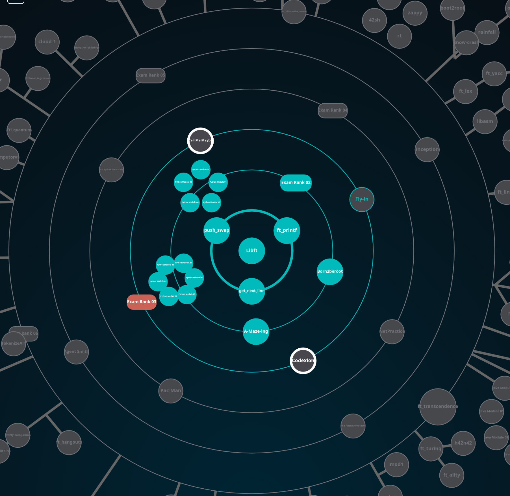

# Hey, I'm Hamid 👋

### Student at 1337 · Software Engineer in the making · Trust the process, enjoy the process
---

## What is 1337 for me?

Comfort zones are well-decorated prisons — I lived in one.
1337 is my escape. To challenge myself. To stop doubting myself.
Surrounded by people who push their limits every day —
this energy simply stops you from hiding the best version of yourself.
I'm here to find out what I'm actually made of.

---

## ⚔️ LeetCode Stats

---

## 🗺️ My DSA Roadmap

| Phase | Patterns | Status |
|-------|----------|--------|
| 1 — Foundation | Arrays & Hashing, Two Pointers, Sliding Window, Prefix Sum | 🔥 In Progress |
| 2 — Linear Structures | Stack, Linked List, Binary Search | ⏳ Up next |
| 3 — Trees & Graphs | Tree DFS/BFS, BST, Graph, Union Find | ⏳ Locked |
| 4 — Backtracking | Backtracking | ⏳ Locked |
| 5 — Heap & Greedy | Heap, Priority Queue, Greedy | ⏳ Locked |
| 6 — DP & Advanced | 1D/2D DP, Intervals, Tries, Bit Manipulation | ⏳ Locked |

📋 [Use this template for your own tracker →](https://heavenly-party-45d.notion.site/355d8b96494881edb458c581cd2b568b?v=355d8b9649488178965b000c3e656a88&source=copy_link)
---

## 🎯 42 Holy Graph
 
<!-- To add your holy graph:
1. Take a screenshot of your holy graph from the 42 intranet
2. In your terminal: mkdir assets && cp ~/path/to/screenshot.png assets/holygraph.png
3. git add . && git commit -m "add holy graph" && git push
4. Then delete this comment and uncomment the line below -->
 

 
---

## 🛠️ Tech Stack

---

## 📊 GitHub Stats

---

---

> *"The struggle itself is what builds the memory. Easy re-reads do almost nothing."*

<!-- Update the roadmap table above as you progress through each phase -->
